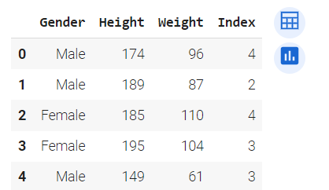
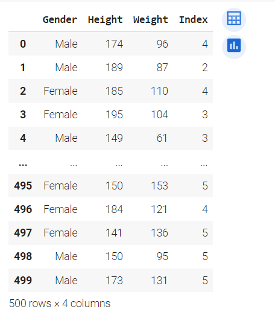
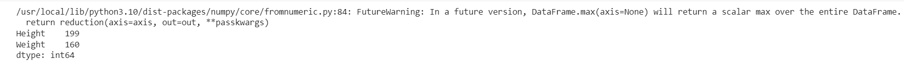
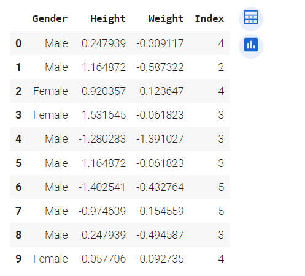
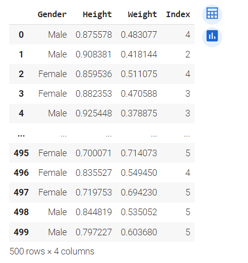
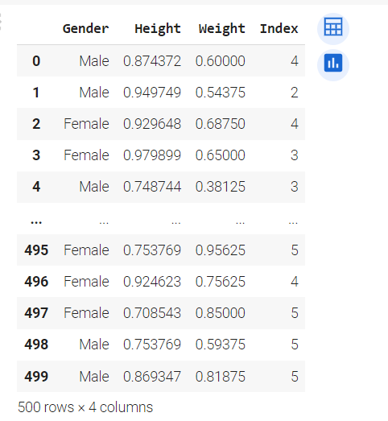
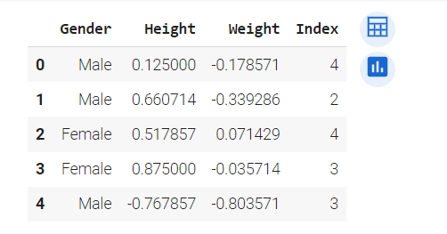

# Ex:05 Feature Generation

## AIM
To read the given data and perform Feature Encoding & Scaling process and save the data to a file.

## EXPLANATION
Feature Generation (also known as feature construction, feature extraction or feature engineering) is the process of transforming features into new features that better relate to the target.

## ALGORITHM
## STEP 1
Read the given Data

## STEP 2
Clean the Data Set using Data Cleaning Process

## STEP 3
Apply Feature Generation techniques to all the feature of the data set

## STEP 4
Save the data to the file

## CODE
```
Developed by: Barath S
Register number: 212222230018
```
```python
import pandas as pd
from scipy import stats
import numpy as np
df = pd.read_csv("bmi.csv")
df.head()
df.dropna()
max_vals = np.max(np.abs(df[['Height','Weight']]))
max_vals
from sklearn.preprocessing import StandardScaler
sc = StandardScaler()
df[['Height','Weight']] = sc.fit_transform(df[['Height','Weight']])
df.head(10)
from sklearn.preprocessing import MinMaxScaler
scaler  = MinMaxScaler()
df[['Height','Weight']] = scaler.fit_transform(df[['Height','Weight']])
df.head(10)
df2 = pd.read_csv("bmi.csv")
from sklearn.preprocessing import Normalizer
scaler = Normalizer()
df2[['Height','Weight']] = scaler.fit_transform(df2[['Height','Weight']])
df2
df3 = pd.read_csv("bmi.csv")
from sklearn.preprocessing import MaxAbsScaler
scaler = MaxAbsScaler()
df3[['Height','Weight']] = scaler.fit_transform(df3[['Height','Weight']])
df3
df4 = pd.read_csv("bmi.csv")
from sklearn.preprocessing import RobustScaler
scaler = RobustScaler()
df4[['Height','Weight']] = scaler.fit_transform(df4[['Height','Weight']])
df4.head()
```

## OUTPUT

## Dataset

## dropna()

## maxvalues

## Standard Scaler


## Normalizer

## MaxAbs Scaler

## Robust Scaler


## OUTPUT
The Programs has been executed successfully.
